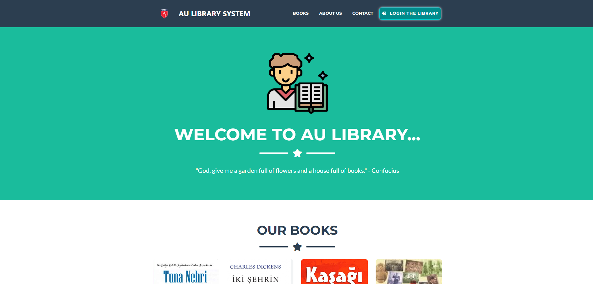
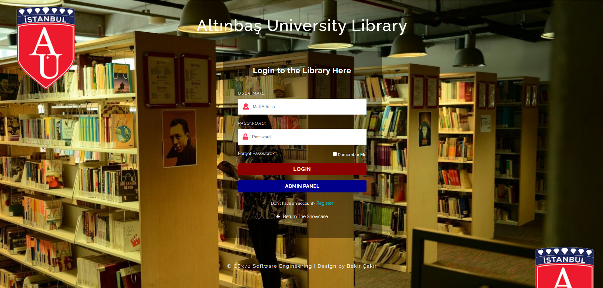
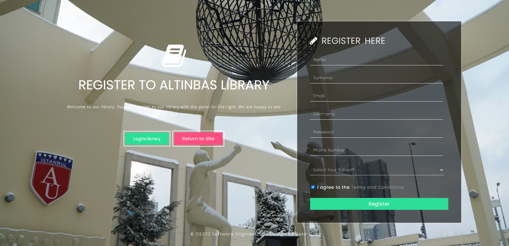
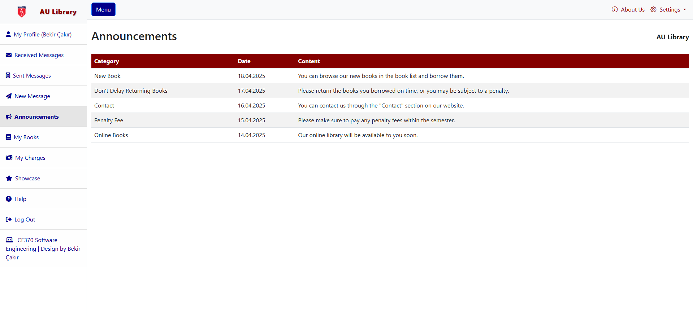
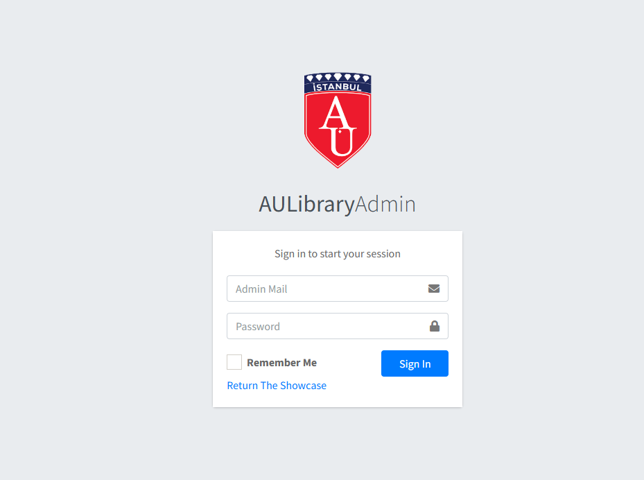
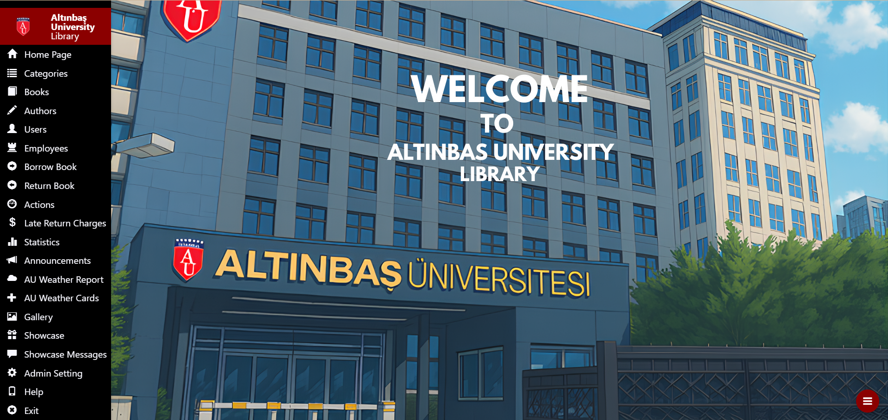

# 📚 AU Library System – Altınbaş University Library Management System

Welcome to the official repository of **AU Library System**, a web-based library management system built using ASP.NET MVC5, Entity Framework, and MS SQL Server. This system was developed as a term project for the CE370 Software Engineering course at Altınbaş University.

🌐 **Live Website**: [https://aulibrary.com.tr/](https://aulibrary.com.tr/)

---

## 🔍 Overview

AU Library System addresses key inefficiencies in traditional library processes by offering:

- 📦 Modular structure (Admin Panel, User Panel, Showcase Page)
- 🔒 Role-based access (Admin, User, Guest)
- 📈 Dynamic statistics and LINQ cards
- 🧾 Penalty tracking and finance management
- 📬 Messaging, gallery, weather API, and more!

---

## 🖼️ Screenshots

### 🏠 Showcase Panel
Public access to book list, about us, contact form, and registration.

---

### 👤 User Panel
Registered members can borrow/return books, track penalties, and receive notifications.

---

### 🔐 Admin Panel
Admins manage books, users, authors, penalties, gallery uploads, and statistics.

---

## ⚙️ Core Features

- 🔐 **Login & Registration** (User and Admin)
- 📚 **Borrow / Return Books** with overdue tracking
- 🧮 **Penalty Calculation** (1 TL/day)
- 📊 **Dashboard Statistics** with most read books, active members, etc.
- 📷 **Gallery Module** for uploading visuals
- 🌦️ **Weather API** integration
- 📢 **Announcements & Messaging**
- 🧾 **Financial Tracking** (cash register summary)

---

## 🧱 Technologies Used

| Layer             | Technology              |
|------------------|-------------------------|
| Front-End        | HTML, CSS, Bootstrap    |
| Back-End         | ASP.NET MVC5, C#        |
| Database         | MS SQL Server, EF       |
| External API     | OpenWeatherMap          |
| Other            | LINQ, Entity Framework  |

---

## 👥 Roles and Permissions

| Role      | Capabilities                                                                 |
|-----------|------------------------------------------------------------------------------|
| Guest     | View books, about us, send contact form                                      |
| Member    | Borrow/return books, view history, receive penalties/announcements          |
| Admin     | Manage books, users, categories, staff, gallery, weather, finances, stats    |

---

## 🔧 How to Run Locally

1. Clone the repo:https://github.com/kullaniciadiniz/AU-Library-System.git
2. Open in **Visual Studio**.
3. Configure your connection string in `Web.config`.
4. Run the project (IIS Express or local).

---

## 👨‍💻 Developers

- Bekir ÇAKIR 

## 📜 License

This project is for educational purposes and not intended for commercial use.  
MIT License can be added if needed.

